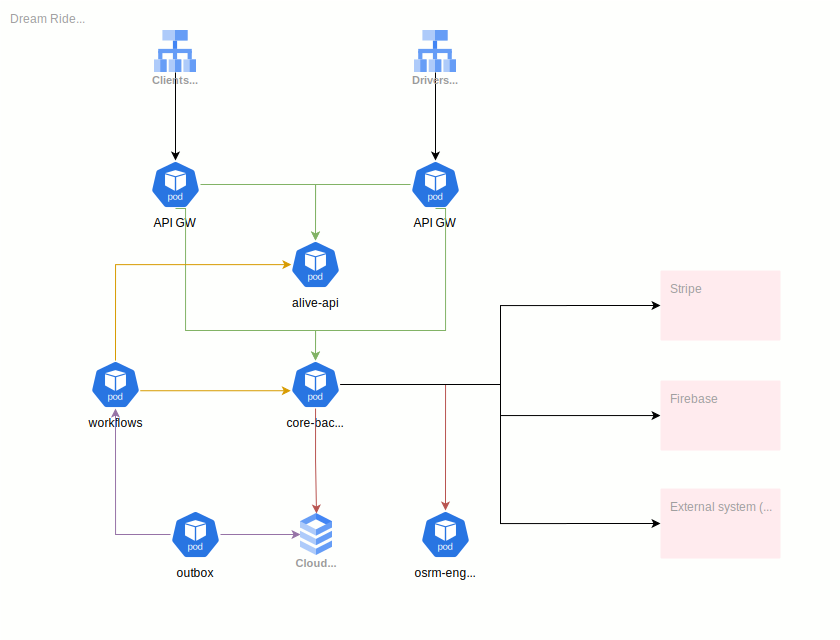

# Глава 1: Что же такое микросервисы?

> В этой главе мы попытаемся разобраться в том, что такое микросервисная архитектура, какие преимущества она
> дает и о том, как и на основании чего стоит принимать решение о декомпозиции приложения на несколько
> отдельных deployment-unit

## Введение

Виктор только что вернулся из командировки, в рамках которой он побывал на таких конференциях, как Highload и DDD Europe, на которых докладчики часто говорили о микросервисах, описывая их преимущества. Виктора заинтересовала эта тема, однако, как и многие хорошие архитекторы, он решил разобраться в ней подробнее. Он начал изучать тему, просматривая множество докладов и изучая классическую литературу, вроде книг [Сэма Ньюмена]() и [Криса Ричардсона]().

По результатам своих исследований, Виктор пришел к выводу, что микросервисом называют какое-то небольшое и автономное приложение, которое отвечает за четкий перечень связанных между собой обязанностей. Не очень понятно, верно?

Помимо этого, во многих источниках описываются следующие преимущества микросервисной архитектуры

- Она обеспечивает автономность команд разработчиков.
- Она упрощает поставку ценности (деплой) в крупных приложениях.
- Она позволяет экспериментировать и внедрять новые технологии.
- Сервисы лучше масштабируются.
- Сервисы получаются небольшими и простыми в обслуживании, с лучшей изоляцией от сбоев.

А к недостаткам монолитной архитектуры обычно относят примерно одни и те же утверждения

- Медленная разработка
- Сложная поставка ценности клиентам (долгий деплой)
- Низкая надежность
- Плохая масштабируемость

Более того, Виктор заметил, что, например, Ричардсон в своей книге утверждает, что рано или поздно разработка монолитного приложения превратиться в то, что он называет "монолитным адом"

> С одной стороны, дисциплинированная команда способна замедлить процесс скатывания в монолитный ад Они также не смогут ничего
> поделать с постоянно устаревающим стеком технологий. В их власти лишь отсрочить
> неизбежное. Чтобы убежать из монолитного ада, придется мигрировать на новую,
> микросервисную архитектуру.

Во всем этом наборе утверждений было что-то, что смущало Виктора. И если с таким тезисом, как упрощенное внедрение технологий, Виктор был согласен, так как микросервисы действительно позволяют писать отдельные системы на других языках программирования или более современных версиях фреймворков, то с некоторыми другими, например, усложненным деплоем и замедлением разработки в монолитах, глядя на свой крупный проект, над которыми трудятся десятки команд, он не мог согласится.

Почему так? Для ответа на этот вопрос стоит подробнее рассмотреть архитектуру монолитного приложения компании Dream Ride.

## Архитектура системы DreamRide

### Общее представление

Прежде, чем погружаться в подробности устройства монолитного бэкенда компании Dream Ride, давайте сначала рассмотрим верхнеуровневую архитектуру всего решения.



В глаза сразу бросается система `core-backend`, из названия которой можно предположить, что эта система является монолитным бэкендом, реализующим всю основную функциональность системы. Однако, так же мы можем заметить, что на схеме изображен некоторый набор других компонентов и систем. И если с `core-backend` всё в целом понятно, то другие компоненты определенно требуют разъяснения. Что же, давайте рассмотрим их подробнее

**Cloud LB**

Балансировщики нагрузки, пускающие трафик в кластер GKE (Google Kubernetes Engine). Как мы можем заметить, их два (Clients и Drivers). Каждый из этих балансировщиков нагрузки обслуживает трафик только конкретных типов пользователей. Например

- Clients api lb - обслуживает входящий трафик, поступающий от клиентов компании
- Drivers api lb - обслуживает входящий трафик, поступающий от водителей, работающих в компании

Также мы можем увидеть, что каждый балансировщик нагрузки запускает трафик в кластер на конкретный выделенный экземпляр `API GW`

**API GW**

Шлюзы апи (api gateway), которые умеют проксировать внешние запросы на внутренние сервисы. Как мы можем заметить, под каждый экземпляр балансировщика нагрузки выделен свой шлюз, который умеет обрабатывать строго заданный набор URL адресов и проксировать их во внутреннюю инфраструктуру.

Каждый из шлюзов апи взаимодействует с двумя другими системами: `alive-api` и `core-backend`

**Alive api**

Небольшая система, которая позволяет пользователям (как клиентам, так и водителям) получать обновления, возникающие в системе, в режиме реального времени. Поддерживает коммуникацию с клиентами с помощью `webscoket`

**Core backend**

Ядро системы. Является монолитным `ASP .Net Core` приложением, которое реализует всю необходимую функциональность для работы с поездками, клиентами, автомобилями и тд. Это приложение состоит из большого количества модулей, над которыми трудятся большое количество команд. Его архитектуру мы рассмотрим несколько позднее.

**Cloud SQL**

Облачная база данных, предоставляемая Google Cloud

**Outbox**

Небольшая система, которая является одним из компонентов, реализующих `transactional outbox`. Она считывает события из базы данных (табличка `outbox`) и перенаправляет их в другие компоненты. В данном случае, их потребителем является сервис `workflows`. Подробнее об этом паттерне мы поговорим в последующих главах.

**Osrm engine**

Система, реализующая логику маршрутизации, построенная на основе open-source проекта [OSRM-Backend](https://github.com/Project-OSRM/osrm-backend)

**Workflows**

Отдельный сервис, который описывает логику процессов, которые существуют в компании Dream Ride. Виктор решил описать эти процессы с использованием `temporal workflows`. Сам кластер `temporal` на диаграмме выше не изображен, поскольку в данном случае он не сильно нам интересен.

### Архитектура core-backend

Итак, общее понимание архитектуры всего решения мы получили. Мы ещё поговорим о том, почему Виктор решил сделать систему именно такой и на основании чего он принимал многие архитектурные решения. А пока, давайте рассмотрим в деталях самую интересную часть - монолитное приложение `core-backend`.

Если говорить о монолите `core-backend`, то мы можем заметить, что Виктор, как и любой опытный архитектор, организовал очень хорошо структурированный монолит, который состоял из десятков независимых модулей.
При детальном рассмотрении архитектуры монолита, который построил Виктор, мы можем заметить несколько отличительных особенностей. Например, мы можем заметить, что монолит спроектирован по принципу plugin-based архитектуры и состоит из нескольких частей:

- Хост приложения, который является executable entrypoint (composition root), где происходит инициализация приложения и загрузка всех модулей
- Общие модули и библиотеки, которые представляют из себя транзитивные зависимости и могут быть использованы в любых других модулях
- Набор фиче-модулей, за разработку которых отвечают различные команды. Эти модули живут в отдельных репозиториях и подключаются в хост приложения посредством обычных библиотек. У каждого модуля свой репозиторий, релизный цикл и свой набор CI/CD пайплайнов

Давайте детальнее рассмотрим процесс релиза новой версии какого-либо модуля. Для этого нужно разобраться в структуре репозитория типичного фиче-модуля на примере модуля обработки заказов.

```
.
├── .github
│   └── workflows
│       ├── bump.yml
│       ├── build.yml
│       ├── test.yml
│       └── promote.yml
├── src
│   ├── OrdersApi
│   ├── OrdersApi.IpcApi
│   ├── OrdersApi.Server
│   ├── OrdersApi.Tests.Unit
│   └── OrdersApi.Tests.Functional
├── OrdersApi.sln
└── README.md
```

Здесь мы можем увидеть, что в корне репозитория лежит файл проекта, а сам репозиторий состоит из нескольких директорий верхнего уровня. Давайте рассмотрим его структуру подробнее.

**.github**

Эта папка содержит в себе набор воркфлоу и `Github` пайплайнов

**OrdersApi.sln**

Solution файл `.net` проекта, который необходим для запуска проекта во всех основных `.net` IDE

**src**

Эта директория содержит в себе несколько `.net` проектов разных типов

- **OrdersApi.IpcApi** - опциональный с точки зрения устройства модуля проект, который предоставляет публичные интерфейсы другим компонентам всего приложения.
- **OrdersApi** - проект, который содержит набор контроллеров, описание сущностей и бизнес-логику, которая реализует все необходимые функциональные требования модуля заказов. Также этот проект реализует набор публичных интерфейсов, объявленных в проекте `OrdersApi.IpcApi`
- **OrdersApi.Server** - проект, являющийся пустым приложением `Asp .Net Core`, которое повторяет по смыслу хост монолитного приложения, о котором мы писали ранее. Это приложение необходимо для локального тестирования разработанного модуля и работает абсолютно так же, как и хост монолита: загружает модуль и подключает его к системе маршрутизации `Asp .Net Core`, инициализирует миграции и запускает все необходимые фоновые процессы, которые могут быть описаны в модуле.
- **OrdersApi.Tests.Unit** - проект юнит-тестов, написанный на `xunit`. Подключает в качестве зависимостей проект `OrdersApi` и покрывает юнит-тестами всю необходимую логику
- **OrdersApi.Tests.Functional** - проект функциональных тестов, так же использующий `xunit`. Он подключает к себе проект `OrdersApi.Server` и тестирует его набор эндпоинтов с настоящей базой данных. При этом, все внешние зависимости заменяются с помощью моков.

Теперь хочется сказать пару слов о том, как происходит разработка и поставка новых версий в production.

[TODO]

Итак, мы рассмотрели текущую архитектуру системы компании Dream Ride. Уверен, что у вас осталось множество вопросов. Почему был выбран именно такой дизайн? Какие преимущества он дает? На основании чего и как принимались решения? Мы обязательно ответим на эти вопросы в следующих разделах, но перед этим необходимо обсудить достаточно важную тему: типы требований, с которыми нам, как архитекторам, приходится работать при проектировании архитектуры.

## Типы требований

В этом разделе хочется немного погрузится в такую тему, как требования, типы требований и архитектурные характеристики.

Почему это важно? Дело в том, что без понимания требований, т.е. того, что система должна делать и какие базовые возможности она должна предоставлять пользователям, кто ней будет пользоваться, какое количество пользователей будет с ней взаимодействовать, мы не сумеем даже понять нашу задачу. Очень часто в профильной литературе, которая связана с архитектурой (в основном речь о solution и enterprise архитектурах) можно встретить такой термин, как `stakeholder` - обычно этот термин означает "заинтересованное лицо" или группу лиц, имеющих свои интересы в том или ином проекте.

При проектировании и разработке системы мы всегда должны стремиться к тому, чтобы разрабатываемая система удовлетворяла ожиданиям и реализовывала потребности всех стейкхолдеров. Их идентификация и менеджмент - отдельная большая тема, которая выходит за пределы этой книги. Здесь же я приведу примеры того, кто в том или ином проекте может считаться стейкхолдером. Например, для компании Dream Ride Виктор определил группы различных стейкхолдеров, часть из которых описана ниже

1. клиенты - интерес клиентов заключается в получении качественного сервиса, который оправдывал бы свое позиционирование на рынке
2. различные регуляторы и муниципалитеты - интересы муниципалитетов заключаются в том, чтобы компания, оказывающая услуги частных перевозок, соблюдала все нормы и законы, которые касаются многих сфер: от надежности работы с персональными данными, до обеспечения гарантии исправности транспортных средств, от которых зависит лицензирование компании на осуществление операционной деятельности
3. отдел операций - интересы отдела операций заключаются в построении стабильных и эффективных HRMS процессов, процессов управления парком автомобилей, выполнения заказов (например, уменьшение времени реакции на заказ со стороны водителя), уменьшении количества инцидентов и проработка политик реагирования на них, если они возникают
4. отдел маркетинга - интересы отдела маркетинга заключаются в том, чтобы разработать наиболее эффективные маркетинговые стратегии привлечения бОльшего количества пользователей в систему, чтобы общая выручка и доход компании росли
5. отдел разработки - интересы отдела разработки заключаются в том, чтобы обеспечивать максимальную надежность системы, гарантируя её работоспособность. помимо этого, отдел разработки хочет улучшать качество кодовой базы и архитектуры, чтобы скорость поставки новых решений оставалась на высоком уровне
6. отдел дизайна - их интерес заключается в том, чтобы создать такой UI/UX, который максимально эффективно решал бы потребности клиентов, а так же увеличивал продуктовые показатели конверсии в первый заказ и продуктовые показатели flat retention
7. отдел юристов - их интерес заключается в том, чтобы компания соблюдала все требования со стороны регуляторов, поскольку компания хочет избежать несчастных случаев и инициирования судебных дел, что может закончится штрафами, потерей репутации и бизнеса
8. водители - интересы водителей заключаются в возможности оказания своих услуг с целью получения заработка

Как мы можем заметить, у каждого стейкхолдера полно своих уникальных ожиданий, которые они хотели бы закрыть с помощью новой системы. И, на самом деле, задача архитектора во многом сводится к тому, чтобы определить этот список ожиданий и проработать набор решений для его реализации. Но это далеко не так просто, как может показаться! Очень часто архитектор может попадать в ситуации, когда различные стейкхолдеры преследуют разные цели и интересы, которые могут противоречить ожиданиям и целям других заинтересованных сторон. И задача архитектора заключается в том числе в поиске таких решений, которые позволили бы удовлетворить всем (но, возможно, не сразу).

Например, Виктор однажды стал перед непростым выбором: отдел юристов внезапно пришел и сказал, что для того, чтобы компания могла продолжать свою операционную деятельность, система компании должна начать предоставлять муниципалитету города информацию о поездках и автомобилях в режиме реального времени. При этом, со стороны продукта так же было весьма срочное требование: нужно спроектировать некоторую функциональность для отдела маркетинга и успеть её разработать, поскольку от неё зависели потенциальные крупные партнерства с другими компаниями в городе.

Виктор пообщался с различными заинтересованными сторонами и по результатам переговоров, муниципалитет города пошел на некоторые уступки и разрешил разработать интеграцию несколько позже, благодаря чему Виктор сфокусировался на проработке продуктовых задач и после вернулся к регуляторным требованиям. Но бывают и совсем уж неприятные ситуации: когда требования или интересы одних стейкхолдеров влияют на реализацию интересов других, или вовсе делают их невозможными! С такими ситуациями тоже необходимо уметь работать и искать баланс

Но, как я выше говорил, тема stakeholder management довольно обширна и уместить её в эту книгу, к сожалению, не выйдет

### Функциональные требования

[TODO]

### Нефункциональные требования

[TODO]

## Почему была выбрана такая архитектура?

После того, как мы немного посмотрели на текущую архитектуру систем и разобрались с типами требований, настало время обсудить, почему Виктор выбрал именно такую архитектуру при проектировании всего решения.

[TODO]

## Но... а где же микросервисы?

Пожалуй, именно такой вопрос вы задали сами себе, пока мы разбирались в архитектуре Dream Ride, типах требований и смотрели на организацию модульного монолита. Но, действительно, где же микросервисы? Несмотря на то, что мы смогли обсудить большое количество вещей, ответа на главный вопрос мы так и не получили. На самом деле, все это необходимо было обсудить прежде, чем мы смогли бы продолжить обсуждение нашей основной темы. И сейчас я предлагаю вернуться к тем утверждениям и характеристикам монолитных и микросервисных архитектур, которые вызвали у Виктора большое количество вопросов и сомнений.

Давайте посмотрим, что говорят о микросервисах такие люди, как Сэм Ньюмен и Крис Ричардсон в своих книгах

> [!IMPORTANT]  
> Это стиль проектирования, который разбивает приложение на отдельные сервисы с разными функциями. Заметьте, что размер здесь вообще не упоминается. Главное, чтобы каждый сервис имел четкий перечень связанных между собой обязанностей (с) Крис Ричардсон

> [!IMPORTANT]  
> Микросервисы — это небольшие, автономные, совместно работающие сервисы (с) Сэм Ньюмен

Вероятно, вы не станете спорить с тем, что оба определения весьма абстрактны и не отвечают на вопрос "что такое микросервисная архитектура". Возможно, стоит подробнее рассмотреть характеристики микросервисной архитектуры, о которых пишут Ньюмэн и Ричардсон в своих книгах? В целом, их характеристики весьма похожи. Давайте на них взглянем.

Крис Ричардсон утверждает, что сервис - разновидность модуля, который может разрабатываться и поставляться независимо от других сервисов. Помимо этого, он выделяет достаточно важным пунктом то, что у каждого сервиса должна быть своя база данных. Общий набор характеристик выглядит примерно так

1. Сервисы небольшие, реализующие узкоспециализированные функции
2. Каждый сервис должен иметь свою собственную базу данных
3. Использование легковесных способов взаимодействия, таких как очереди, брокеры или же HTTP / GRPC
4. Каждый сервис может разрабатываться, тестироваться, развертываться независимо

Сэм Ньюмен же, как упоминалось ранее, утверждает, что сервис - это небольшое автономное приложение. Ключевые характеристики, которые он выделяет, описаны ниже

1. Сервисы небольшие и нацеленные на что-то одно
2. Микросервисная архитектура более автономна
3. Проще масштабируются
4. Упрощают развертывание
5. Позволяют решить организационные вопросы (см. закон Конвея)

В целом, как мы можем заметить, и Ричардсон, и Ньюмэ наделяют микросервисы некоторой группой одинаковых характеристик.

Скажем, давайте возьмем такой критерий (или особенность), как "размер". В понимании обоих авторов микросервис - это обязательно что-то небольшое. При этом, ответа на вопрос "насколько небольшое" в книгах нет. Ну и давайте будем честны: ответ на этот вопрос, скорее всего, дать невозможно, поскольку он сильно зависит от того, что сервис реализует. Если это сервис справочных данных, то вся его реализация может уместиться в одном файле и 100 строк кода. Если это сервис, реализующий логику построения маршрутов на основании OSM данных, то он будет куда больше и сложнее.

Давайте рассмотрим ещё один пример, а именно: группу характеристик, которые относятся к поставке, решению вопросов организационной структуры, разработки и тестированию. Оба автора утверждают, что микросервисы позволяют существенно улучшить эти показатели во всем процессе разработки. Но, как мы увидели на примере выше, когда обсуждали архитектуру модульного монолита, со всеми этими характеристиками в модульных монолитах дела обстоят ничуть не хуже!

Каждый модуль в Dream Ride находится в отдельном репозитории. Все модули имеют свой жизненный цикл и независимый процесс поставки, в рамках которого каждый модуль независимо тестируется, собирается, проверяется на уязвимости и тд. Можем ли мы утверждать, что каждый модуль - независимый микросервис? Если исходить только из описанных выше характеристик, то, наверное, можем, поскольку упаковка модуля и деплой хост-приложения в таком случае могут быть отнесены к инфраструктурной части CI/CD пайплайнов.

Некоторые из вас могут мне возразить: но как же автономность и наличие отдельных баз данных? Отвечу и на эти вопросы.

Во-первых, никто не мешает использовать в каждом модуле свою базу данных. Нет никаких ни технических, ни идеологических препятствий. Единственная причина, по которой Виктор так не стал делать - более упрощенное управление миграциями, которое для отдела разработки компании вполне приемлемо. При этом, Виктор для каждого модуля использует различные схемы баз данных, что также дает определенную логическую изоляцию.

Во-вторых, понятие автономности сильно преувеличено и зависит от контекста и конкретной архитектуры. Например, в микросервисных архитектурах вы можете захотеть разделить сервисы аутентификации и авторизации, где сервис авторизации будет хранить набор политик доступа к каким-то компонентам. Если сотрудники отдела безопасности придут к выводу, что каждый запрос необходимо будет авторизовывать, то вам придется проектировать такую архитектуру, которая на каждый запрос в систему будет выполнять проверку в сервисе авторизации на допустимость совершения какого-либо действия. Технически, такую проверку можно организовать по-разному. Например, можно проверять из каждого конкретного сервиса, посылая HTTP или GRPC запрос в сервис авторизации, или же можно делать это на API GW, чтобы сделать внутренние сервисы менее зависимыми от сервиса авторизации. Проблема здесь в том, что у вас появляется несколько тесно связанных компонентов, и если сервис авторизации упадет, то ни один ваш запрос (возможно, за исключением запросов в анонимные зоны приложения) не будет обработан. Или, например, вам необходимо ходить в сервис пользователей и проверять, не является ли пользователь заблокированным по какой-либо причине. Опять же, если сервис пользователей будет недоступен, то любой аутентифицированный запрос не будет обработан.

Но это только несколько примеров, которые призваны продемонстрировать, что далеко не всегда микросервисная архитектура дает преимущество автономности. Действительно, могут быть и другие примеры: давайте представим, что сервис заказов работает, а сервис проведения оплат (биллинг) по какой-то причине недоступен. Что в таком случае произойдет с системой? Да, система позволит создавать заказы, но проблема в том, что если пользователи не будут иметь возможность их оплатить, они всё равно не смогут завершить пользовательский сценарий покупки чего-либо и, скорее всего, просто уйдут в другой продукт, где сервис оплат работает. Вероятнее всего, с точки зрения продукта и UX действительно хорошо, что мы хотя бы дали возможность пользователям посмотреть каталог товаров и увидеть хоть что-то, но с точки зрения бизнеса всё равно бизнес теряет как деньги, так и клиентов.

Зачем я вам все это говорю? Я лишь хочу продемонстрировать, что определений и характеристик выше недостаточно, поскольку они на самом деле являются такими же абстрактными, как и само понятие микросервисной архитектуры. Как мы легко могли заметить, архитектуры вроде модульных монолитов обладают если не всеми, то бОльшей частью характеристик, которые приписывают микросервисным архитектурам. Нет никакого "монолитного ада" - это лишь результат бездействия по части контролирования архитектуры, а многие недостатки, которые приписывают монолитным системам, вызывают сомнения, поскольку все зависит от умения и возможностей реализовать тот или иной вид архитектуры.

А с учетом расплывчатости описанных характеристик, многие из которых можно организовать в различных типах архитектур (в т.ч. и в монолитных), когда в диалоге звучит "микросервисная архитектура", каждый представляет себе что-то своё: кто-то представляет системы, которые поголовно дублируют данные и общаются с помощью брокеров, кто-то думает об организационной структуре компании и команд, кто-то просто понимает небольшие отдельные единицы развертывания, даже если они не связаны друг с другом. И это определенно добавляет проблем, поскольку для эффективного обсуждения собеседникам приходится описывать конкретный набор технологий и подходов, которые они используют в своих микросервисных архитектурах.

В такой ситуации, кажется, мы могли бы придумать какое-то свое определение, которое будем использовать в рамках этой книги. Например, оно могло бы звучать как-то так

> Микросервисная архитектура - это вид архитектуры, которая состоит из множества различных приложений, каждое из которых реализует свой небольшой кусочек функциональности, сгруппированных вокруг какой-то конкретной потребности. При этом весь набор таких систем обладает следующими характеристиками
>
> - множество систем (ну, скажем, более 5 или 10)
> - все решение имеет более одной базы данных
> - каждая система имеет раздельный деплой и запускается в своем процессе
> - каждая система взаимодействует с другими с помощью современных протоколов

Звучит несколько более конкретно, верно? Но... Я предлагаю не заниматься этим и не использовать понятие "микросервисных архитектур" вообще! Да, вам не показалось. Вы можете спросить: "но, как же, ведь книга о микросервисах?" - да, в названии действительно речь идет о микросервисных архитектурах. Так проще, поскольку многие слышали этот термин, хотя и не понимают в реальности, что он означает.

И на этом этапе мы подобрались к самой главной сути. В этой книге я предлагаю сфокусироваться на совершенно других вещах: вместо попытки дать очередное определение микросервисным архитектурам мы поговорим о проблемах, возникающих практически во всех распределенных системах, как только у вас система разделяется на несколько независимых, но при этом взаимодействующих друг с другом единиц развертывания.
